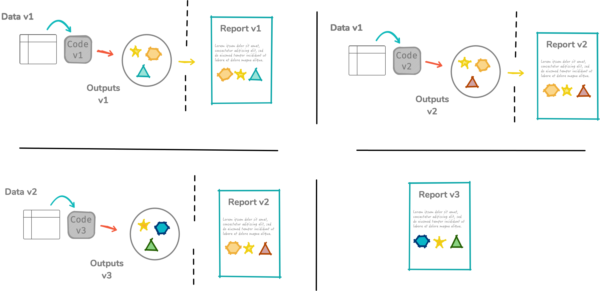

# Power of R Markdown

## Example: my fancy graph

Behold! My plot that shows the linear trend!

```{r myplot, echo = FALSE, message = FALSE, fig.align = "center", fig.height = 2, fig.width = 4}
library(tidyverse)
ggplot(mtcars, aes(mpg, disp, color = factor(cyl))) + 
  geom_point() + theme_bw(base_size = 18)
```

## Example: code and output demonstration

This is how you use `tidyverse` to fit simple linear models to each level in `cyl` .

```{r pkgshow, message = FALSE}
library(tidyverse)
mtcars %>% 
   split(.$cyl) %>% 
   map_dfr(~{
      fit <- lm(mpg ~ disp, data = .)
      slope_ests <- coef(fit)
      c(cyl = .$cyl[1], n = nrow(.), slope_ests)
   })
```


## R Markdown Motivation: More robust to modifications

```{r, echo = FALSE, out.width = "100%"}

```


```{r export, include = FALSE}
library(pdftools)
pdf_convert("example-beamer2.pdf", format = "png", dpi = 200)
fns <- list.files(pattern = "example-beamer2_")
purrr::walk(fns, ~{
  file.copy(.x, paste0("images/", .x), overwrite = TRUE)
  file.remove(.x)
})
```
